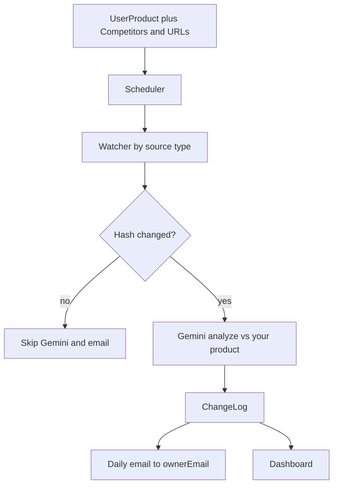

# Competitor monitor — phases and tasks

Industry-agnostic competitor monitoring for a founder: configure **your** product, pick **any** rivals, watch public update sources, let **Gemini** filter noise, send a **daily email digest**. Slack is deferred. Frontend is a small dashboard in Phase 5 only.

Build **in order**. After each phase, run that phase’s **What to test / How** section. Do not start the next phase until those checks pass.

**How to read the test blocks:** *What* is the assertion; *How* is the command or action; *Pass* is what you should see.


| Phase | Focus                        | Status      |
| ----- | ---------------------------- | ----------- |
| 1     | Scaffold + schema + CLI      | Done        |
| 2     | Watchers + hashing/diff      | Done        |
| 3     | Gemini analysis + ChangeLog  | Done        |
| 4     | Email digest + AlertLog      | Done        |
| 5     | Scheduler, dashboard, README | Done        |


**Stack:** Node.js + TypeScript, MongoDB (Mongoose), Google Gemini (`@google/generative-ai`), node-cron, Nodemailer (SMTP), optional Next.js dashboard at the end.

**Decisions**

- AI is **Gemini**, not Anthropic (`GEMINI_API_KEY`, optional `GEMINI_MODEL`).
- Email is **Nodemailer + SMTP**, not SES/Resend.
- **No Slack** in this build (`sendSlackAlert` and `SLACK_WEBHOOK_URL` later).
- No hardcoded industry or competitors.

---


## Product (what this is)

A founder-facing tool so you do not have to read every Play Store note, App Store release, blog post, or changelog yourself.

You describe **your product** (name, industry, description, owner email) and add **competitors** with source URLs. The loop is:

1. **Watch** those URLs on a schedule.
2. **Diff** — hash content; skip if unchanged.
3. **Analyze** — Gemini decides if it is a real product change vs noise, writes a short summary, tags an area, scores urgency *for your product*.
4. **Notify** — daily HTML email to `ownerEmail`. Dashboard (Phase 5) shows a timeline.

It is not a login scraper, social listener, or industry database. It only fetches **URLs you provide**.

### How each piece is used


| Input                                     | Used for                                             |
| ----------------------------------------- | ---------------------------------------------------- |
| UserProduct name / industry / description | Gemini system prompt (analysis vs *you*)             |
| `ownerEmail`                              | Daily digest recipient                               |
| Competitor + `source.type`                | Which watcher to run                                 |
| `source.url`                              | The only URL fetched                                 |
| `lastCheckedHash`                         | Skip Gemini and email if unchanged                   |
| `GEMINI_API_KEY`                          | Phase 3+ only, and only on a real content change     |
| MongoDB                                   | Products, competitors, hashes, ChangeLogs, AlertLogs |
| SMTP                                      | Phase 4+ daily digest                                |


### Frontend vs backend

- **Backend (**`src/`**)** — the real product: models, watchers, Gemini, email, cron. Phases 1–4 are backend only. Setup starts as a CLI.
- **Frontend (Phase 5)** — Next.js App Router: onboarding, add competitor, changelog timeline. No auth in v1. The browser does not run watchers or Gemini.
- One repo for local use. Email still sends if nobody opens the dashboard.




---


## Phase 1 — Scaffold + schema

**Goal:** Project structure, env template, Mongoose models, CLI to add a product and competitors. No watchers, AI, or email yet.

### Tasks

- [x] Create folders: `src/watchers/`, `src/services/`, `src/models/`, `src/jobs/`, `src/config/`, `src/api/`
- [x] `tsconfig.json` with `strict: true`, `outDir: dist`, `rootDir: src`
- [x] `package.json` scripts: `dev`, `build`, `start`, `add-competitor`
- [x] `.env.example`: `GEMINI_API_KEY`, `GEMINI_MODEL`, `MONGODB_URI`, `SMTP_HOST`, `SMTP_PORT`, `SMTP_USER`, `SMTP_PASS`, `EMAIL_FROM` (no Slack)
- [x] `.gitignore` including `.env` (never commit the Gemini key)
- [x] Env loader + Mongo connect helper
- [x] Model **UserProduct**: `name`, `industry`, `description`, `ownerEmail`
- [x] Model **Competitor**: `userProductId`, `name`, `sources[{ type, url, lastCheckedHash, lastCheckedAt }]` — types: `playstore` / `appstore` / `blog_rss` / `website`
- [x] Model **ChangeLog**: `competitorId`, `sourceType`, `rawDiff`, `aiSummary`, `relevantArea`, `urgency`, `isMeaningful`, `detectedAt`, `notified`
- [x] Model **AlertLog**: `changeLogId`, `channel` (`email` now; `slack` reserved), `sentAt`
- [x] CLI `src/jobs/addCompetitor.ts`: create/select UserProduct, add competitor name + source URLs dynamically (no seed of industry-specific rivals)
- [x] Confirm: `npm install` + `npx tsc --noEmit`; CLI writes documents when Mongo is running


### What to test / How (Phase 1)

**Prereq:** MongoDB running locally (or a valid Atlas `MONGODB_URI` in `.env`). Copy `.env.example` → `.env` if needed.


| #   | What                                   | How                                                                                                             | Pass                                                                                                                    |
| --- | -------------------------------------- | --------------------------------------------------------------------------------------------------------------- | ----------------------------------------------------------------------------------------------------------------------- |
| 1.1 | Project typechecks                     | `npx tsc --noEmit`                                                                                              | Exit 0, no errors                                                                                                       |
| 1.2 | App connects to Mongo                  | `npm run dev`                                                                                                   | Logs `MongoDB connected` and collection counts (can be 0)                                                               |
| 1.3 | Missing Mongo fails clearly            | Temporarily break `MONGODB_URI` or stop Mongo, then `npm run dev`                                               | Process errors; restore `.env` after                                                                                    |
| 1.4 | Create your product + a competitor     | `npm run add-competitor` — enter name, industry, description, owner email, competitor name, a source type + URL | Prints `UserProduct ID` and `Competitor ID`                                                                             |
| 1.5 | Data is in Mongo                       | Compass / `mongosh` on DB `competitor-monitor`: `db.userproducts.find()`, `db.competitors.find()`               | One product with the four fields; competitor has `userProductId` and `sources[]` with `type` + `url`; hashes still null |
| 1.6 | Select existing product                | Run `npm run add-competitor` again, pick the numbered product, add a second competitor                          | New competitor row; product count stays 1                                                                               |
| 1.7 | All four source types can be stored    | Add sources of types `playstore`, `appstore`, `blog_rss`, `website` (can be on one or several competitors)      | Each type appears in `sources.type` — no fetch yet                                                                      |
| 1.8 | Nothing industry-specific is hardcoded | Search the repo for a specific brand/app list in `src/`                                                         | Only user-entered names; no seed of named rivals                                                                        |
| 1.9 | Secrets stay local                     | `.env` is gitignored; `.env.example` has empty `GEMINI_API_KEY=`                                                | Real key is not in git or `.env.example`                                                                                |


**Do not test yet:** fetching pages, Gemini, email, dashboard.

---


## Phase 2 — Watchers + diffing

**Goal:** Fetch each source type, hash content, detect changes. **No Gemini and no email.**

### Tasks

- [x] `src/watchers/playStoreWatcher.ts` — google-play-scraper for “What’s New” release notes
- [x] `src/watchers/appStoreWatcher.ts` — app-store-scraper equivalent
- [x] `src/watchers/blogRssWatcher.ts` — rss-parser for any RSS feed
- [x] `src/watchers/websiteWatcher.ts` — fetch + cheerio for generic page-content diffing
- [x] `src/services/diffService.ts` — fetch by `source.type`, sha256 hash, compare to `lastCheckedHash`, update hash/timestamp if changed, produce a raw diff object
- [x] `src/jobs/testWatch.ts` — run across all competitors for a test UserProduct and log results (prove detection across source types)
- [x] npm script e.g. `test-watch`

**Done when:** Running `testWatch` against configured competitors logs unchanged vs changed, and hashes update in Mongo. No ChangeLogs from AI yet.

**How to run**

```bash
npm run add-competitor
npm run test-watch
npm run test-watch -- <userProductId>
```

First run should log `[CHANGED]` (baseline hash). Second run should log `[UNCHANGED]`. A bad URL should log `[ERROR]` for that source only.

### What to test / How (Phase 2)

**Prereq:** Phase 1 data exists. Use real public URLs you are allowed to fetch, for example:

- `website` — any public changelog or homepage
- `blog_rss` — a public RSS/Atom URL
- `playstore` — a Play listing URL or app id the scraper accepts
- `appstore` — an App Store listing URL or id the scraper accepts


| #   | What                              | How                                                                                                                                                              | Pass                                                                                                                                      |
| --- | --------------------------------- | ---------------------------------------------------------------------------------------------------------------------------------------------------------------- | ----------------------------------------------------------------------------------------------------------------------------------------- |
| 2.1 | Typecheck after new deps          | `npx tsc --noEmit`                                                                                                                                               | Exit 0                                                                                                                                    |
| 2.2 | First watch is a baseline         | `npm run test-watch` (or the script name added in this phase)                                                                                                    | Each source is fetched; `changed: true` (or “first check”) because hash was empty; `lastCheckedHash` and `lastCheckedAt` are set in Mongo |
| 2.3 | Second watch is a no-op           | Run `test-watch` again immediately                                                                                                                               | Same sources log **unchanged** / no diff; hashes **do not** change                                                                        |
| 2.4 | A real content change is detected | For a `website` source: temporarily point URL at a page you control, or clear `lastCheckedHash` in Mongo then wait until the live page differs; run `test-watch` | Logs a raw diff object (before/after or text snippet); hash updates to the new sha256                                                     |
| 2.5 | Watcher routing by type           | Competitors covering all four `source.type` values                                                                                                               | Logs show the matching watcher (Play / App Store / RSS / website), not one watcher for everything                                         |
| 2.6 | Bad URL fails that source only    | Add a competitor source with a nonsense URL; run `test-watch`                                                                                                    | That source errors; other sources still complete                                                                                          |
| 2.7 | No AI / no email                  | Inspect logs and Mongo after `test-watch`                                                                                                                        | No Gemini calls; `changelogs` still empty (or unchanged from Phase 1); no SMTP                                                            |


**Pause** if 2.2–2.5 fail. Diff bugs will poison later AI and email.

---


## Phase 3 — AI analysis

**Goal:** On a real diff, Gemini decides if it matters to **this** founder and we persist a ChangeLog.

### Tasks

- [x] Add `@google/generative-ai`
- [x] `src/services/aiAnalysisService.ts` — `analyzeChange(userProduct, competitorName, sourceType, rawDiff)`
- [x] System prompt: competitive intelligence analyst for the founder of `[userProduct.name]`, a `[userProduct.industry]` product described as `[userProduct.description]`
- [x] (1) `isMeaningful` — real product/feature change vs noise (typos, generic “bug fixes and improvements,” minor copy)
- [x] (2) If meaningful: 2–3 sentence `aiSummary`
- [x] (3) `relevantArea` as free-text (not a fixed enum), inferred vs the user’s product
- [x] (4) `urgency` `low` / `medium` / `high` for **this** founder’s product
- [x] Force strict JSON; parse safely with a fallback
- [x] Wire into `diffService`: on a real diff, call analysis with UserProduct context, save ChangeLog; skip/mark false for noise

**Done when:** A changed source produces a ChangeLog; noise is stored as not meaningful.

**How to run:** `npm run watch-now` (Gemini on non-baseline diffs). `npm run test-watch` still hashes only. First fetch is a baseline and does **not** call Gemini — set `lastCheckedHash` to `force-diff` to force analysis.

### What to test / How (Phase 3)

**Prereq:** `GEMINI_API_KEY` in `.env`. Phase 2 hashes working. To force a new diff: set `sources.$.lastCheckedHash` to `"force-diff"` in Mongo, or use a page whose content changed.


| #   | What                             | How                                                                                                  | Pass                                                                                                                                                                                                         |
| --- | -------------------------------- | ---------------------------------------------------------------------------------------------------- | ------------------------------------------------------------------------------------------------------------------------------------------------------------------------------------------------------------ |
| 3.1 | No Gemini when unchanged         | Run watch/diff with hashes already matching                                                          | No API call (watch logs / no new ChangeLog)                                                                                                                                                                  |
| 3.2 | Meaningful change → ChangeLog    | Force a diff on a real feature/release note; run the watch job                                       | New `changelogs` doc: `isMeaningful: true`, 2–3 sentence `aiSummary`, non-empty `relevantArea` (free text), `urgency` one of `low` / `medium` / `high`, `rawDiff` present, `competitorId` + `sourceType` set |
| 3.3 | Analysis is about *your* product | Use a UserProduct in a specific industry; inspect `aiSummary`                                        | Summary mentions overlap/relevance to **your** product, not a generic news blurb                                                                                                                             |
| 3.4 | Noise is marked not meaningful   | Force a diff whose new text is only “Bug fixes and performance improvements” (or similar); run watch | ChangeLog saved with `isMeaningful: false` (summary may be empty/short); this item must **not** be treated as alert-worthy later                                                                             |
| 3.5 | JSON parse fallback              | Temporarily break the model name (`GEMINI_MODEL=does-not-exist`) or simulate non-JSON; then restore  | App does not crash; fallback object is stored (e.g. `isMeaningful: false`) and error is logged                                                                                                               |
| 3.6 | Urgency enum                     | Inspect several ChangeLogs                                                                           | Only `low`, `medium`, or `high` (or null on fallback) — never a free-form urgency string                                                                                                                     |


**Do not test yet:** email send. Confirm ChangeLogs look right in Mongo first.

---


## Phase 4 — Notifications (email only)

**Goal:** Daily HTML digest. No Slack.

### Tasks

- [x] Add `nodemailer`
- [x] `src/services/notificationService.ts` — `sendEmailDigest(changeLogs[], userProduct)` HTML digest to `userProduct.ownerEmail`, grouped by competitor
- [x] Dedupe via AlertLog before sending; write AlertLog after (`channel: email`)
- [x] Do **not** implement `sendSlackAlert` or webhook posting
- [x] `src/jobs/dailyDigest.ts` — for each UserProduct, digest last 24h meaningful ChangeLogs
- [x] npm script e.g. `daily-digest`

**Done when:** A test digest sends (or logs clearly if SMTP is unset) and AlertLog rows prevent duplicates.

**How to run:** `npm run daily-digest`

### What to test / How (Phase 4)

**Prereq:** SMTP filled in `.env` (`SMTP_HOST`, `SMTP_PORT`, `SMTP_USER`, `SMTP_PASS`, `EMAIL_FROM`). `UserProduct.ownerEmail` is an inbox you can open. At least one ChangeLog from the last 24h with `isMeaningful: true`.

If SMTP is not ready: the job must **log clearly and exit without crashing**. That is a pass for the “unset SMTP” case only.


| #   | What                  | How                                                                   | Pass                                                                                                                              |
| --- | --------------------- | --------------------------------------------------------------------- | --------------------------------------------------------------------------------------------------------------------------------- |
| 4.1 | Digest sends          | `npm run daily-digest`                                                | Email arrives at `ownerEmail`                                                                                                     |
| 4.2 | Grouped by competitor | Open the HTML                                                         | Sections/headings per competitor; date, area, urgency, summary visible                                                            |
| 4.3 | Noise excluded        | Have both `isMeaningful: true` and `false` ChangeLogs in the last 24h | Only meaningful items in the email                                                                                                |
| 4.4 | AlertLog written      | Mongo `db.alertlogs.find()`                                           | One row per included ChangeLog, `channel: "email"`, `sentAt` set                                                                  |
| 4.5 | Dedupe                | Run `daily-digest` again immediately                                  | **No** second email for the same ChangeLogs (or empty “nothing new”); no duplicate AlertLogs for the same `changeLogId` + `email` |
| 4.6 | Unset SMTP            | Clear SMTP vars, run digest, restore `.env`                           | Clear error/skip log; process does not hang                                                                                       |
| 4.7 | No Slack              | Search `src/` for webhook posts                                       | No Slack send on watch or digest                                                                                                  |


---


## Phase 5 — Scheduling, dashboard, docs

**Goal:** Run the pipeline on a timer, add a local UI, write README.

### Tasks — scheduler

- [x] `src/jobs/scheduler.ts` with node-cron
- [x] Every 12h: watch → diff → analyze → persist ChangeLog for all UserProducts/Competitors
- [x] Once a day: `dailyDigest` per user
- [x] Works as a long-running process **and** as an AWS Lambda-compatible handler export


### Tasks — dashboard (Next.js App Router)

- [x] Minimal app (e.g. `dashboard/` or `web/`) with Tailwind
- [x] Onboarding form: product name, industry, description (and owner email)
- [x] Add competitor form: name + source URLs
- [x] API route `/api/changelogs` filtered by `userProductId`
- [x] Page: competitor-grouped timeline (date, area tag, urgency badge, summary)
- [x] No auth for v1 (single-user local use)


### Tasks — README

- [x] Project overview (product explanation above, non-technical / interviewer-skimmable)
- [x] Mermaid architecture diagram
- [x] Setup instructions (Mongo, `.env`, CLI, scheduler, dashboard)
- [x] How it works: 4-stage pipeline, industry-agnostic, email-only alerts, Slack as a future add

**Done when:** Scheduler can run locally, dashboard shows a timeline for configured data, README is complete.

### What to test / How (Phase 5)

**Scheduler**


| #   | What                        | How                                                                                                                                         | Pass                                                                       |
| --- | --------------------------- | ------------------------------------------------------------------------------------------------------------------------------------------- | -------------------------------------------------------------------------- |
| 5.1 | Long-running process starts | `npm run start` or the scheduler script                                                                                                     | Process stays up; logs that 12h watch and daily digest cron are registered |
| 5.2 | Pipeline can run on demand  | Invoke the same function the cron calls (exported `runWatchPipeline` / handler), or temporarily use a `* * * * *` cron **once** then revert | Watch → diff → Gemini (only on change) → ChangeLog; no Slack               |
| 5.3 | Daily digest cron exists    | Read `scheduler.ts`                                                                                                                         | A once-per-day expression calling `dailyDigest` per UserProduct            |
| 5.4 | Lambda-style export         | `import { handler } from "./jobs/scheduler"` (or documented export) and call it once                                                        | One-shot run of the pipeline; suitable for a scheduled Lambda later        |


**Dashboard**


| #    | What             | How                                                     | Pass                                                                                                                     |
| ---- | ---------------- | ------------------------------------------------------- | ------------------------------------------------------------------------------------------------------------------------ |
| 5.5  | App boots        | From the Next app folder, `npm run dev`                 | Page loads locally                                                                                                       |
| 5.6  | Onboarding       | Submit product name, industry, description, owner email | New UserProduct in Mongo                                                                                                 |
| 5.7  | Add competitor   | Submit name + at least one source URL/type              | New Competitor linked to that product                                                                                    |
| 5.8  | Changelogs API   | `GET /api/changelogs?userProductId=<id>`                | JSON filtered to that product only                                                                                       |
| 5.9  | Timeline UI      | Open the timeline page                                  | Grouped by competitor; date, area tag, urgency badge, summary. Noise (`isMeaningful: false`) hidden or clearly separated |
| 5.10 | No auth required | Open in a private window                                | Forms and timeline work (v1 single-user)                                                                                 |


**README**


| #    | What                     | How                                                | Pass                                                                   |
| ---- | ------------------------ | -------------------------------------------------- | ---------------------------------------------------------------------- |
| 5.11 | Skimmable product story  | Read README top                                    | Who it’s for, industry-agnostic, 4-stage loop, email-only, Slack later |
| 5.12 | Architecture diagram     | Mermaid in README                                  | Watch → diff → Gemini → ChangeLog → digest + dashboard                 |
| 5.13 | Setup works from the doc | Follow README on a clean checkout (Mongo + `.env`) | CLI or dashboard can add a product; a watch job runs                   |


---


## Later (out of scope)

- Slack Incoming Webhooks (`sendSlackAlert` for meaningful + medium/high urgency)
- Auth on the dashboard
- SES / Resend as extra email providers

---


## Confirm-before-next

After each phase, run that phase’s **What to test / How** table. Phases 1–5 are implemented. Use the test tables (3.1–3.6, 4.1–4.7, 5.1–5.13) to verify.