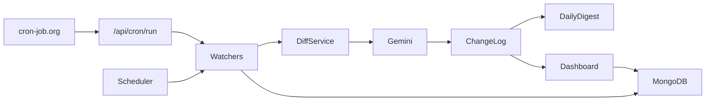

# Competitor monitor

A founder-facing tool for watching **any** rivals — fintech, SaaS, e-commerce, or something else — without reading every store listing, blog post, or changelog yourself.

You describe **your** product. You pick **your** competitors and the public URLs to watch. The tool hashes those sources, asks **Gemini** whether a change actually matters to you, and sends a **daily email digest**. There is no hardcoded industry list and no Slack in this version.

## Who it is for

Anyone shipping a product who wants a short, relevant signal when a competitor ships something real — not a firehose of “bug fixes and improvements.”

## How it works

Four stages:

1. **Watch** — Play Store “What’s New,” App Store release notes, Google News RSS, any blog RSS feed, or a generic webpage (optionally scoped to a CSS selector, so only changes inside e.g. the changelog section count).
2. **Diff** — sha256 the canonical text and compare it to the last check. Unchanged sources skip everything else. For RSS/news feeds, change detection hashes the *set of item identities* instead of the whole feed, so reshuffles or rotating headlines never look like a change — only genuinely new items do. The **first** successful fetch is a baseline (hash only; no Gemini).
3. **Analyze** — Gemini acts as a competitive-intelligence analyst for *your* product: meaningful vs noise, 2–3 sentence summary, free-text area, urgency (`low` / `medium` / `high`) for **you**. New feed items are matched by normalized title against the competitor’s recent analyses, so the same story arriving via Google News *and* the blog RSS is analyzed (and emailed) once, not twice.
4. **Notify** — a daily HTML email to `ownerEmail`, grouped by competitor. A local dashboard shows the same timeline. Slack is a later add.

On a laptop, a long-running `npm run scheduler` process is the clock. In production on [Vercel](https://vercel.com), that process cannot stay alive, so [cron-job.org](https://cron-job.org) pings the app on a schedule instead.



Frontend vs backend: the Node worker in `src/` does the watching, Gemini calls, and email. The Next.js app in `dashboard/` saves configuration, reads the timeline, and (on Vercel) exposes `/api/cron/run` so an external cron can start that worker. The browser never calls Gemini.

## cron-job.org (production clock)

**What it is:** a free service that issues an HTTP GET to a URL at times you choose. It does not scrape Play Store, fetch news, or call Gemini.

**Why we use it:** Vercel Hobby cannot run `npm run scheduler` (no always-on process). Vercel’s own cron is limited to **once per day**, but we need a watch every **12 hours** plus a daily digest. cron-job.org is only the alarm; Vercel still does the work.

Create two GET jobs. Use the same `CRON_SECRET` as in Vercel environment variables (never commit it).

| Job | What it does | URL | Schedule |
| --- | --- | --- | --- |
| `competitor-watch` | Fetch sources, hash, Gemini on real diffs | `https://YOUR_DOMAIN/api/cron/run?job=watch&secret=CRON_SECRET` | `0 */12 * * *` (every 12 hours) |
| `competitor-digest` | Email meaningful changes to `ownerEmail` | `https://YOUR_DOMAIN/api/cron/run?job=digest&secret=CRON_SECRET` | `0 8 * * *` (daily; set timezone, e.g. Asia/Kolkata) |

The endpoint returns **202** immediately so cron-job.org’s ~30s free timeout does not mark the job failed. The pipeline can keep running on Vercel for up to 5 minutes. Check **Vercel → Logs** for `[UNCHANGED]`, `[BASELINE]`, `[ANALYZED]`, and `[cron] watch finished`.

Do not schedule watch every 15 minutes — that burns Gemini quota and store rate limits.

On a laptop, skip cron-job.org and use `npm run scheduler` instead.

## Setup

**Prerequisites:** Node 18+, MongoDB (local or Atlas).

1. Copy environment variables:

```bash
cp .env.example .env
```

2. Fill in at least:

- `MONGODB_URI`
- `GEMINI_API_KEY` (and optionally `GEMINI_MODEL`)
- SMTP fields when you want email: `SMTP_HOST`, `SMTP_PORT`, `SMTP_USER`, `SMTP_PASS`, `EMAIL_FROM`
- `CRON_SECRET` when you deploy (protects `/api/cron/run`)

Never commit `.env`.

3. Install and typecheck:

```bash
npm install
npx tsc --noEmit
cd dashboard && npm install && cd ..
```

4. Add your product (CLI), then a competitor **name** (sources are discovered automatically):

```bash
npm run add-competitor
```

Or open the dashboard (no login in v1):

```bash
npm run dashboard
```

Then visit `http://localhost:3000`. Add a competitor **by name only** — the backend looks up Play Store, App Store, website, RSS, and Google News.

## Useful commands

| Command | What it does |
| --- | --- |
| `npm run test-watch` | Fetch + hash only (no Gemini, no email) |
| `npm run watch-now` | Full pipeline: watch → diff → Gemini → ChangeLog |
| `npm run daily-digest` | Email last 24h of **meaningful** changes; AlertLog dedupes |
| `npm run scheduler` / `npm start` | Long-running process: watch every 12h, digest daily at 08:00 |
| `npm run status` | Print Mongo collection counts |
| `npm run dashboard` | Next.js UI |

Force a new analysis after a baseline: set a source’s `lastCheckedHash` to something else in Mongo (e.g. `"force-diff"`), then `npm run watch-now`.

## Optional: Lambda

`src/jobs/scheduler.ts` still exports `handler` if you prefer EventBridge instead of cron-job.org:

```ts
import { handler } from "./jobs/scheduler";

await handler({ job: "watch" });   // pipeline only
await handler({ job: "digest" });  // email only
await handler({ job: "all" });     // both (default)
```

The long-running Node process uses `node-cron` instead of Lambda.

## What this is not

Not a login scraper, not social listening, not a database of famous competitors. It only fetches **URLs you provide**.
