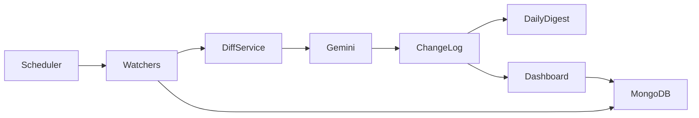

# Competitor monitor

A founder-facing tool for watching **any** rivals — fintech, SaaS, e-commerce, or something else — without reading every store listing, blog post, or changelog yourself.

You describe **your** product. You pick **your** competitors and the public URLs to watch. The tool hashes those sources, asks **Gemini** whether a change actually matters to you, and sends a **daily email digest**. There is no hardcoded industry list and no Slack in this version.

## Who it is for

Anyone shipping a product who wants a short, relevant signal when a competitor ships something real — not a firehose of “bug fixes and improvements.”

## How it works

Four stages:

1. **Watch** — Play Store “What’s New,” App Store release notes, any RSS feed, or a generic webpage.
2. **Diff** — sha256 the canonical text and compare it to the last check. Unchanged sources skip everything else. The **first** successful fetch is a baseline (hash only; no Gemini).
3. **Analyze** — Gemini acts as a competitive-intelligence analyst for *your* product: meaningful vs noise, 2–3 sentence summary, free-text area, urgency (`low` / `medium` / `high`) for **you**.
4. **Notify** — a daily HTML email to `ownerEmail`, grouped by competitor. A local dashboard shows the same timeline. Slack is a later add.



Frontend vs backend: the Node worker in `src/` does the watching, Gemini calls, and email. The Next.js app in `dashboard/` only saves configuration and reads the timeline. The browser never calls Gemini.

## Setup

**Prerequisites:** Node 18+, MongoDB (local or Atlas).

1. Copy environment variables:

```bash
cp .env.example .env
```

2. Fill in at least:

- `MONGODB_URI`
- `GEMINI_API_KEY` (and optionally `GEMINI_MODEL`)
- SMTP fields when you want email: `SMTP_HOST`, `SMTP_PORT`, `SMTP_USER`, `SMTP_PASS`, `EMAIL_FROM`

Never commit `.env`.

3. Install and typecheck:

```bash
npm install
npx tsc --noEmit
cd dashboard && npm install && cd ..
```

4. Add your product (CLI), then a competitor **name** (sources are discovered automatically):

```bash
npm run add-competitor
```

Or open the dashboard (no login in v1):

```bash
npm run dashboard
```

Then visit `http://localhost:3000`. Add a competitor **by name only** — the backend looks up Play Store, App Store, website, and RSS (same idea as `E:\compitietor\discover.js`).

## Useful commands

| Command | What it does |
| --- | --- |
| `npm run test-watch` | Fetch + hash only (no Gemini, no email) |
| `npm run watch-now` | Full pipeline: watch → diff → Gemini → ChangeLog |
| `npm run daily-digest` | Email last 24h of **meaningful** changes; AlertLog dedupes |
| `npm run scheduler` / `npm start` | Long-running process: watch every 12h, digest daily at 08:00 |
| `npm run status` | Print Mongo collection counts |
| `npm run dashboard` | Next.js UI |

Force a new analysis after a baseline: set a source’s `lastCheckedHash` to something else in Mongo (e.g. `"force-diff"`), then `npm run watch-now`.

## Lambda

`src/jobs/scheduler.ts` exports `handler`. Point a scheduled Lambda (or EventBridge) at it:

```ts
import { handler } from "./jobs/scheduler";

await handler({ job: "watch" });   // pipeline only
await handler({ job: "digest" });  // email only
await handler({ job: "all" });     // both (default)
```

The long-running Node process uses `node-cron` instead of Lambda.

## What this is not

Not a login scraper, not social listening, not a database of famous competitors. It only fetches **URLs you provide**.
